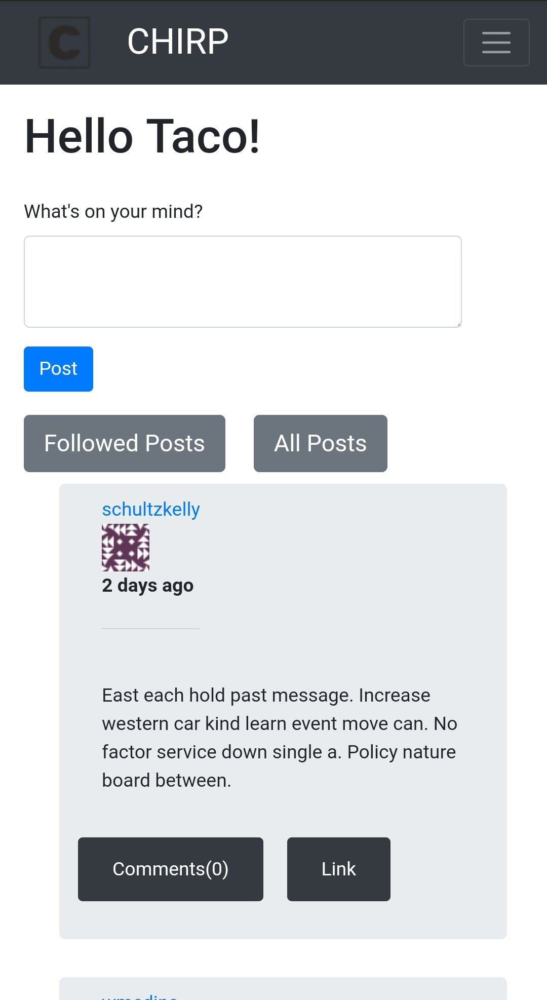
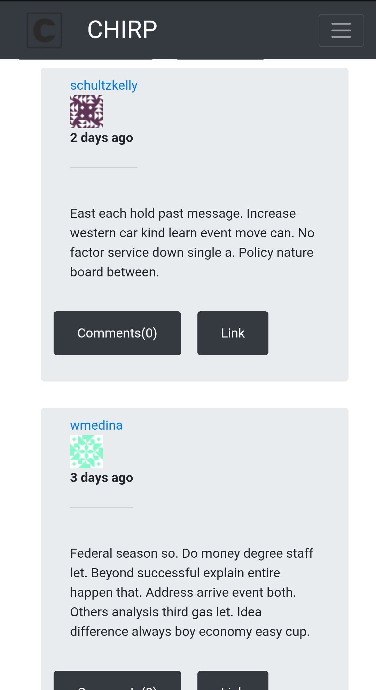
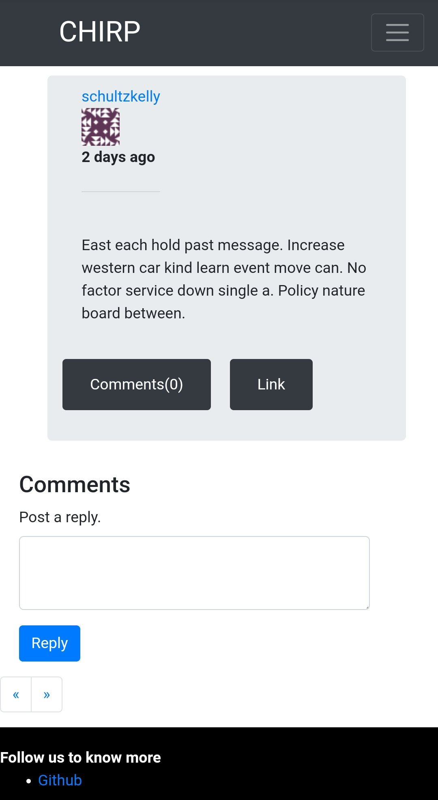
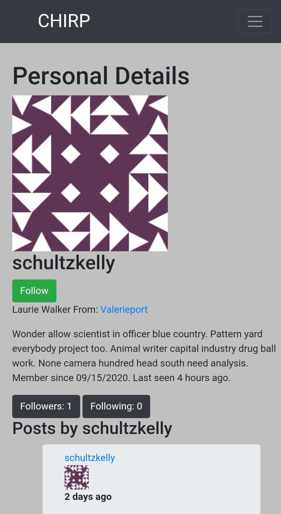
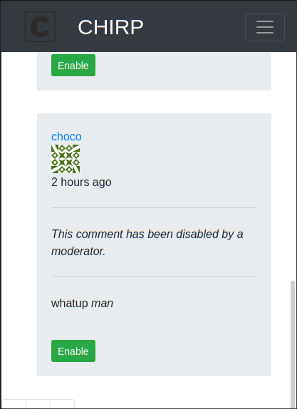

# chirp
P.S: This is my first website, drop a star if you liked the project, constructive criticism welcomed!

**Sections**
* <a href="#tech">TECH USED</a>
* <a href="#demo">DEMO</a>
* <a href="#features">FEATURES</a>
* <a href="#trynow">TRY NOW!</a>
* <a href="#roadmap">ROADMAP</a>
* <a href="#thanks">THANKS</a>

<a id="tech">Tech used</a>
========
A blogging SAAS app made with mobile first approach using:
* Flask
* Bootstrap
* Html5
* Css3

<a id="demo">Demo</a>
=====

 
 
 

<a id="features">Features</a>
========
* Responsive pages configured both for pc and mobile phones
* Roles: admin, moderator, users
* Users can follow each others
* Users can change their email, password and username easily and are verified with email
* Forgotton password can be changed via email easily
* Rich text editor to post markdown like posts
* Admin can change roles of users
* Email verification of users
* Activity of users can be seen on their profile page
* Moderation of comments by moderators
* User data stored securely in a database with password hashing
* Anonymous users can surf the site but cannot post, comment, follow others
* Post feed can be toggled to view all posts or followed posts only
* API features

<a id="trynow">Try now!</a>
=========
`clone` or `download` the repository into your machine.
Make sure to have `python  >= 3.5`

make a virtual env with the command `python3 -m venv venv`.

Activate the environment `venv/source/bin/activate`

`cd` into the folder and install the required libraries with `pip install -r requirements.txt`

configure the database with `flask db upgrade`

Open the `env` file and and copy its content to a `.env` file where you need to input all your personal data

Once done launch your application with `flask run`

Open browser and navigate to `localhost:5000` and enjoy the application

<a id="roadmap">Roadmap</a>
======
Add more tests, make the api more robust

<a id="thanks">Thanks</a>
=======
Inspired from Miguel Grinberg.
Drop a star if you liked the project
